# NetPractice

  
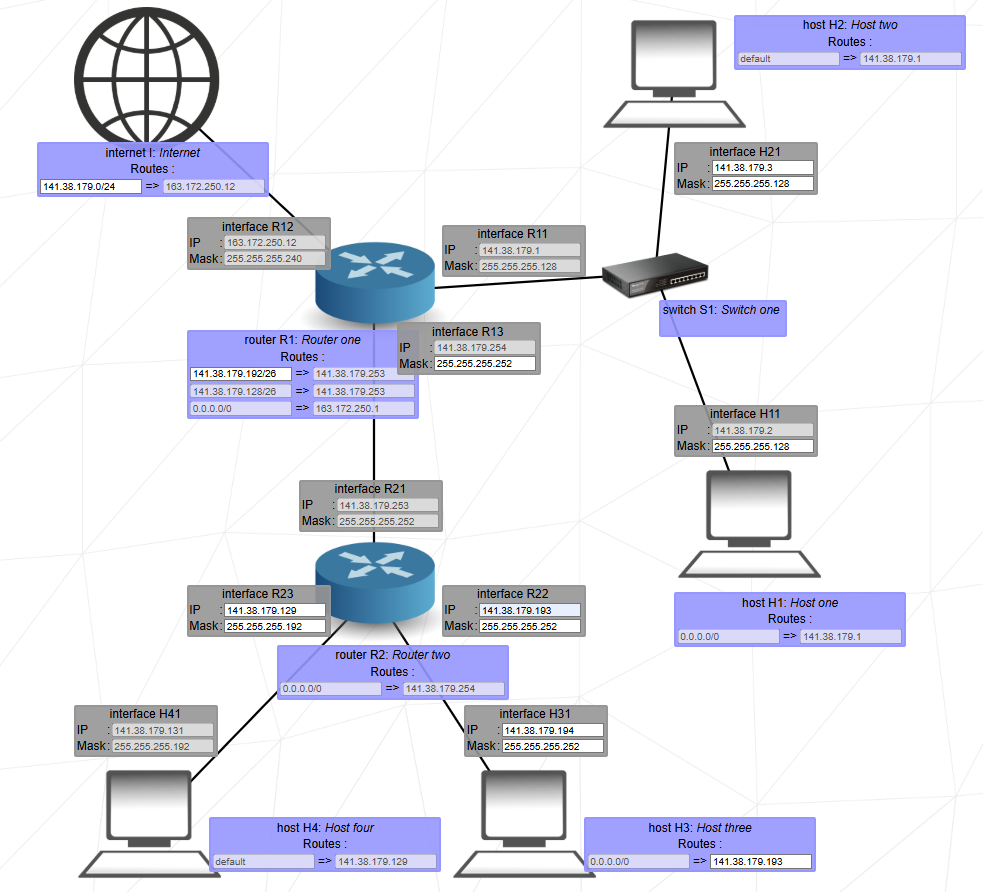

[**42 Cursus Project**] NetPractice is practical networking exercise to configure small-scale networks using TCP/IP addressing principles. Solve 10 simulated network problems to ensure proper functionality.

**Keywords**

- **TCP/IP Addressing**
- **Network Configuration**
- **Subnetting**
- **Routers**
- **Simulated Networks**

Made by: 

---

## Index

- [Overview](#overview)
- [Features](#features)
- [Networking Basics (IPv4)](#networking-basics-ipv4)
  - [Network Masks](#network-masks)
  - [Special IP Ranges](#special-ip-ranges)
  - [Network Devices & Routing](#network-devices--routing)
  - [How Networks Work Together](#how-networks-work-together)
- [NetPractice Tips](#netpractice-tips)
- [What I Learned](#what-i-learned)
- [Solutions](#solutions)
- [Author](#author)
- [Acknowledgments](#acknowledgments)

---

## Overview

NetPractice is a hands-on project designed to teach the fundamentals of networking, focusing on TCP/IP addressing and network device configuration. Through a browser-based interface, users solve 10 progressively challenging levels by correcting misconfigured networks. The project emphasizes practical understanding of routers, subnets, and IP allocation.

**Key Tools**:

- Web-based training interface (`index.html`).
- Manual configuration of IP addresses, subnets, and gateways.

---

## Features

- **10 Simulated Levels**: Each level presents a unique network diagram with specific issues to resolve.
- **Interactive Interface**: Real-time feedback via logs and validation checks.
- **Config Export**: Save configurations for submission using the `[Get my config]` button.
- **Defense Mode**: Complete 3 random levels under time constraints during evaluation.

---

## Networking Basics (IPv4)

This project focuses on IPv4, which uses 32-bit addresses divided into four 8-bit sections (like 192.168.100.1). Each section can range from 0 to 255.

### Network Masks

A network mask (or subnet mask) defines which IP addresses belong to the same subnet (network). It's also a 32-bit number, but its binary representation must have all 1s on the left followed by all 0s on the right (e.g., 255.255.255.0 is valid, 255.255.128.128 is not).

Masks can be written in "dot-decimal notation" (e.g., 255.255.255.0) or CIDR notation (e.g., /24). A smaller CIDR number (like /16) means a larger subnet with more usable IP addresses.

**Important:** Each subnet reserves two IP addresses:

- The network address (the first address in the range)
- The broadcast address (the last address in the range)  
  These two addresses cannot be assigned to devices.

#### Subnetting Reference Table

| CIDR |   Dot-decimal   | Nº of IP-addresses/subnet | Usable IP's/subnet | Number of subnets |
| :--: | :-------------: | :-----------------------: | :----------------: | :---------------: |
| /32  | 255.255.255.255 |             1             |         0          |        256        |
| /31  | 255.255.255.254 |             2             |         0          |        128        |
| /30  | 255.255.255.252 |             4             |         2          |        64         |
| /29  | 255.255.255.248 |             8             |         6          |        32         |
| /28  | 255.255.255.240 |            16             |         14         |        16         |
| /27  | 255.255.255.224 |            32             |         30         |         8         |
| /26  | 255.255.255.192 |            64             |         62         |         4         |
| /25  | 255.255.255.128 |            128            |        126         |         2         |
| /24  |  255.255.255.0  |            256            |        254         |         1         |
| /23  |  255.255.254.0  |            512            |        510         |        N/A        |
| /22  |  255.255.252.0  |           1024            |        1022        |        N/A        |
| /21  |  255.255.248.0  |           2048            |        2046        |        N/A        |
| /20  |  255.255.240.0  |           4096            |        4094        |        N/A        |
| /19  |  255.255.224.0  |           8192            |        8190        |        N/A        |
| /18  |  255.255.192.0  |           16384           |       16382        |        N/A        |

  
Show more of the table

| CIDR |  Dot-decimal  | Nº of IP-addresses/subnet | Usable IP's/subnet | Number of subnets |
| :--: | :-----------: | :-----------------------: | :----------------: | :---------------: |
| /17  | 255.255.128.0 |           32768           |       32766        |        N/A        |
| /16  |  255.255.0.0  |           65536           |       65534        |        N/A        |
| /15  |  255.254.0.0  |          131072           |       131070       |        N/A        |
| /14  |  255.252.0.0  |          262144           |       262142       |        N/A        |
| /13  |  255.248.0.0  |          524288           |       524286       |        N/A        |
| /12  |  255.240.0.0  |          1048576          |      1048574       |        N/A        |
| /11  |  255.224.0.0  |          2097152          |      2097150       |        N/A        |
| /10  |  255.192.0.0  |          4194304          |      4194302       |        N/A        |
|  /9  |  255.128.0.0  |          8388608          |      8388606       |        N/A        |
|  /8  |   255.0.0.0   |         16777216          |      16777214      |        N/A        |
|  /7  |   254.0.0.0   |         33554432          |      33554430      |        N/A        |
|  /6  |   252.0.0.0   |         67108864          |      67108862      |        N/A        |
|  /5  |   248.0.0.0   |         134217728         |     134217726      |        N/A        |
|  /4  |   240.0.0.0   |         268435456         |     268435454      |        N/A        |
|  /3  |   224.0.0.0   |         536870912         |     536870910      |        N/A        |
|  /2  |   192.0.0.0   |        1073741824         |     1073741822     |        N/A        |
|  /1  |   128.0.0.0   |        2147483648         |     2147483646     |        N/A        |
|  /0  |    0.0.0.0    |        4294967296         |     4294967294     |        N/A        |

### Special IP Ranges

Certain IP address ranges are reserved for specific purposes:

- **Private Networks:** Used within local networks and not routable on the global internet. Important for security and internal communication. Internet routers ignore these addresses, preventing external access.
  - 10.0.0.0 – 10.255.255.255
  - 172.16.0.0 – 172.31.255.255
  - 192.168.0.0 – 192.168.255.255
- **Loopback Addresses:** Used for testing and internal communication within a single device.
  - 127.0.0.0 – 127.255.255.255

### Network Devices & Routing

- **Switches:** Simple devices that connect multiple devices within the **same network**. They don't route traffic between different networks.
- **Routers:** Essential for connecting **different networks**. Each router interface connects to a distinct subnet.
- **Routing Tables:** Every device (hosts and routers) needs a routing table to know where to send traffic.
  - **Destination (`0.0.0.0/0` or `default`):** Use this for a "default route" when a device needs to send traffic to _any_ network it doesn't have a more specific route for. This typically points to its directly connected router.
  - **Specific Destination:** For routers, you'll need specific routes to networks they are not directly connected to, pointing to the "next hop" router that can reach that destination.
  - **Next Hop:** The IP address of the _directly connected_ router interface that traffic should be sent to.

### How Networks Work Together

To send data between IP addresses:

- **Same Network:** Devices must be in the same network. You determine if devices are in the same network by performing a bit-by-bit AND operation between their IP address and their subnet mask. If the resulting "network address" is identical for two devices, they are in the same network.  
  Example: 192.168.100.1 AND 255.255.255.0 results in 192.168.100.0 (the network address).
- **Different Networks:** If devices are in different networks, they must be connected via one or more routers. Routers use their routing tables to forward packets from one network to another until they reach the destination network.

Understanding these fundamentals of IP addresses, masks, and routing is crucial for designing and troubleshooting networks.

---

## NetPractice Tips

These tips are based on common challenges and solutions encountered across NetPractice levels, especially when working with IPv4.

### General Strategy

- **Fixed Parameters First:** Always start by identifying any fixed IP addresses or masks in the problem. These often dictate the network ranges you'll need to work within.
- **Subnet Definition:** Clearly define your subnets. Ensure each link (Host-Router, Router-Router) has its own unique network.
- **IP & Mask Harmony:** Devices within the same subnet **must** have IP addresses and masks that result in the same network address (e.g., `192.168.1.10` with `255.255.255.0` gives network `192.168.1.0`).
- **Usable IPs:** Remember that the first (network address) and last (broadcast address) IPs in any subnet are **not usable** for devices.
- **Loopback Prevention:** Pay attention to "loop detected" errors. This often means a device (especially a host or router) is sending traffic back to itself or sending traffic to a connected device that isn't the correct gateway for that destination.

### Handling the "Internet" and IP Types

- **Private vs. Public IPs:** This is critical!
  - **Private IP Ranges:** `10.0.0.0/8`, `172.16.0.0/12`, `192.168.0.0/16`. These are for internal networks and are **NOT routable on the global internet**.
  - **"private subnets not routed over internet":** If you see this error when communicating with the `Internet I` device, it means your host (or its network) is using a private IP, and the "Internet" router refuses to send return traffic to it.
- **No NAT? Use Public IPs:** If Network Address Translation (NAT) isn't an option (or explicitly disallowed), any device that needs to communicate with the `Internet I` **must** be configured with IP addresses from a **publicly routable range**. In NetPractice, this might mean using ranges like `9.x.x.x` or other non-private ranges as instructed by the level.
- **Internet Router Routes:** The `Internet I` device often needs specific routes back to your public-facing networks (e.g., `203.0.112.0/21` pointing to your router's public interface) if those networks are not directly attached or if it's not simply a default route scenario.

### Advanced Routing Concepts

- **Route Summarization (CIDR):** To save routing table entries (especially on routers with strict limits), use larger subnet masks (smaller CIDR numbers like `/21` or `/18`) to group multiple smaller subnets into one route. For example, `203.0.112.0/21` can cover `203.0.113.0/24` and `203.0.114.0/24`.
- **`/30` Subnets:** These are very common for point-to-point links (like between two routers) as they provide exactly two usable IP addresses, minimizing IP waste.

---

## What I Learned

- **TCP/IP Addressing**: Mastered subnetting and gateway configuration.
- **Problem-Solving**: Diagnosed network issues using logical deduction.
- **Precision**: Small errors (e.g., incorrect subnet masks) break entire networks.
- **Understanding of Network Devices**: Gained knowledge about various network devices (routers, and its routing table, and switches) and their roles in a network.

---

## Solutions

The solutions for each level are provided below. Each solution is a screenshot of the completed network configuration for that level.
The solutions are organized by level, with each level's solution displayed in a collapsible section for easy navigation.

 

   
<strong>Level 1</strong>

   

     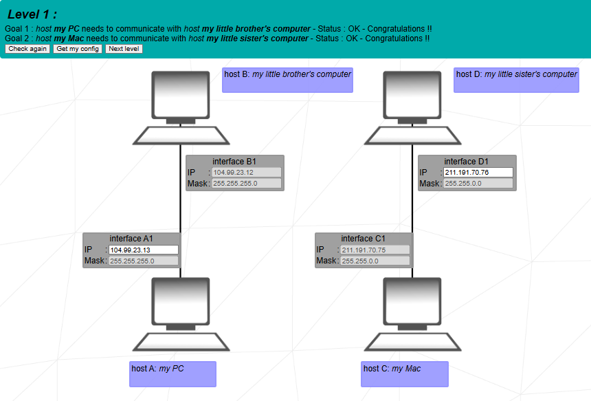
   

 

 

   
<strong>Level 2</strong>

   

     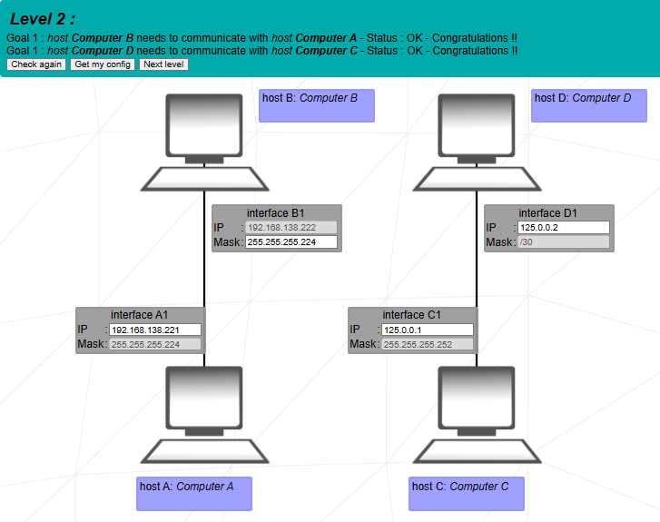
   

 

 

   
<strong>Level 3</strong>

   

     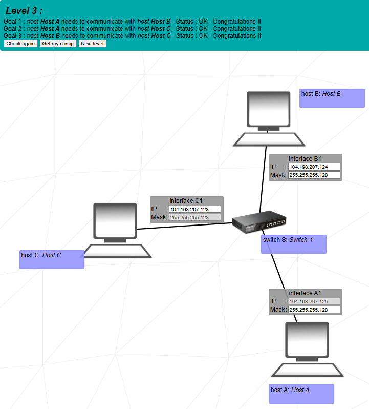
   

 

 

   
<strong>Level 4</strong>

   

     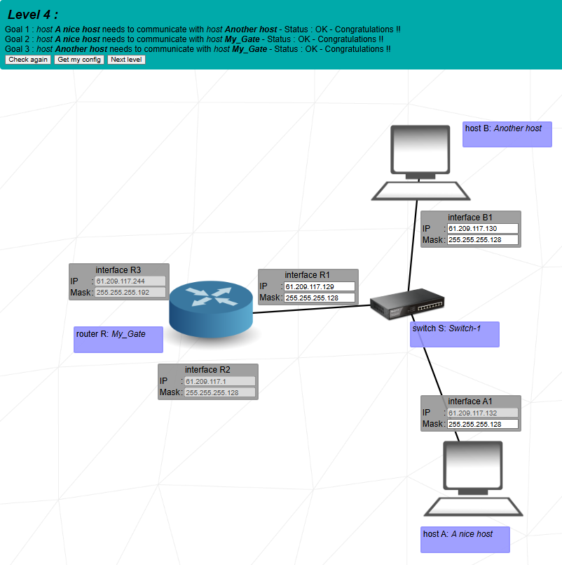
   

 

 

   
<strong>Level 5</strong>

   

     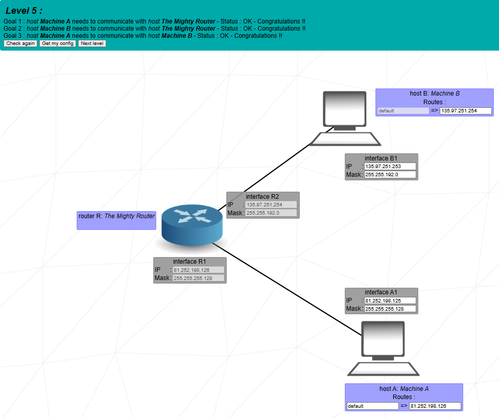
   

 

 

   
<strong>Level 6</strong>

   

     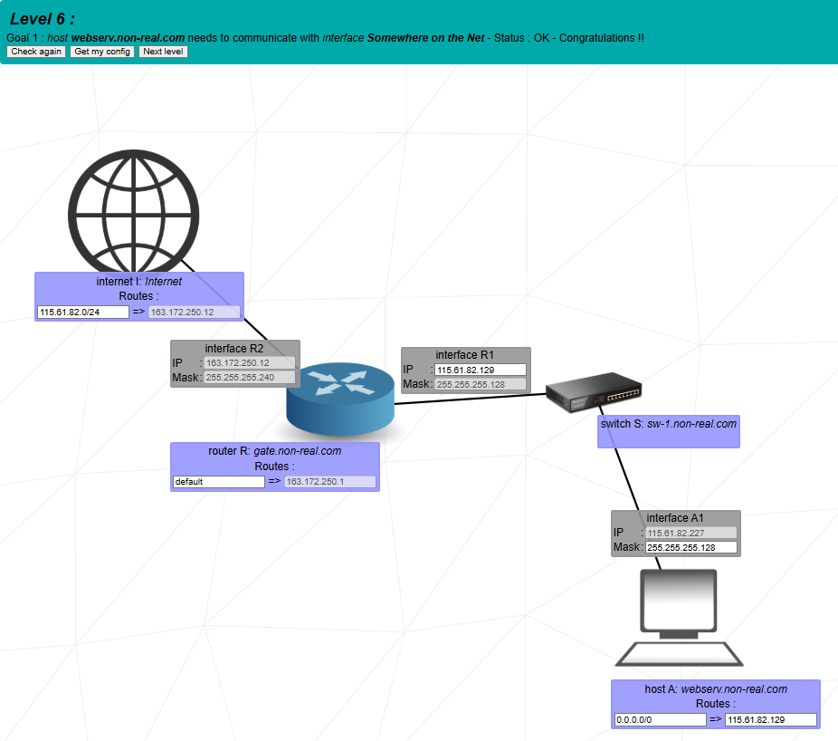
   

 

 

   
<strong>Level 7</strong>

   

     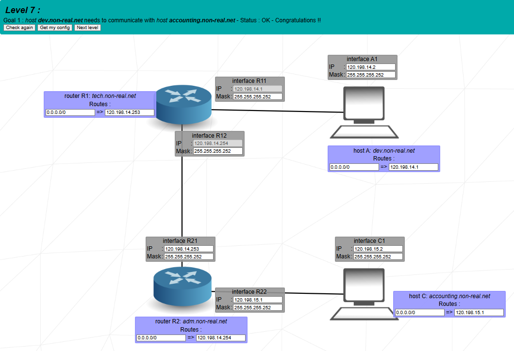
   

 

 

   
<strong>Level 8</strong>

   

     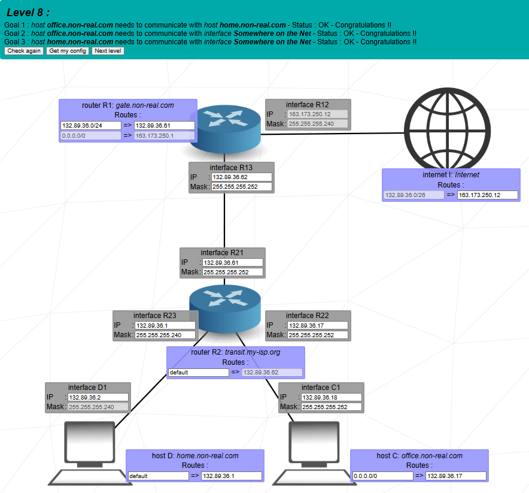
   

 

 

   
<strong>Level 9</strong>

   

     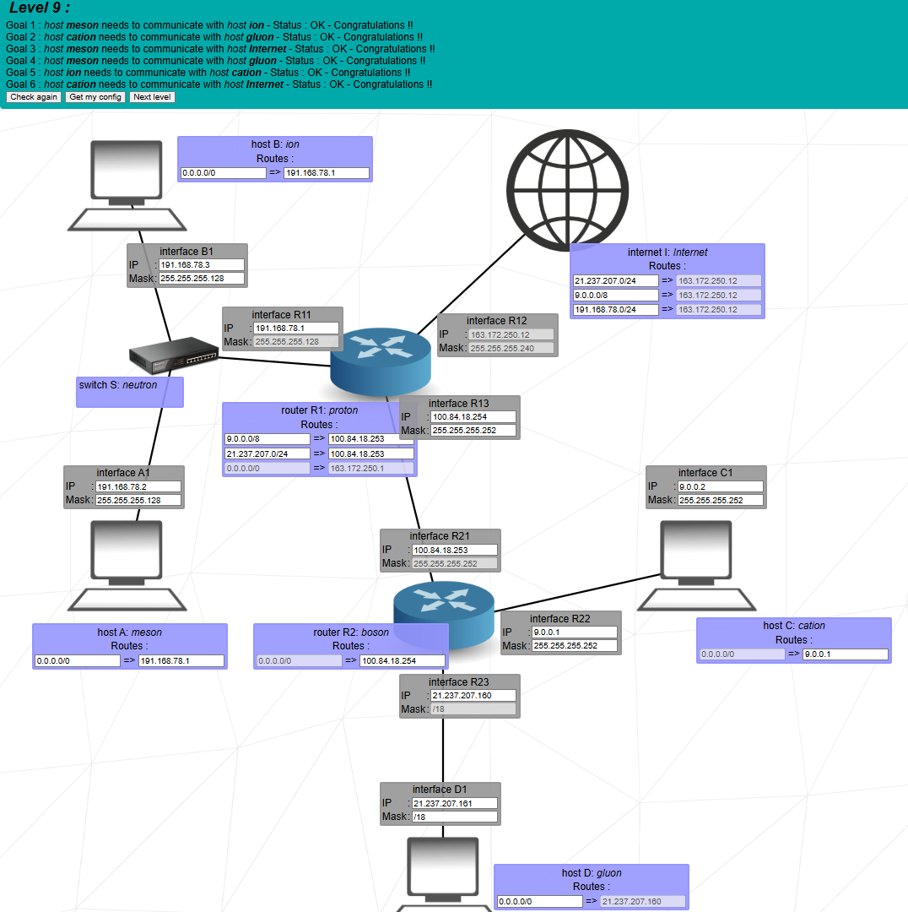
   

 

 

   
<strong>Level 10</strong>

   

     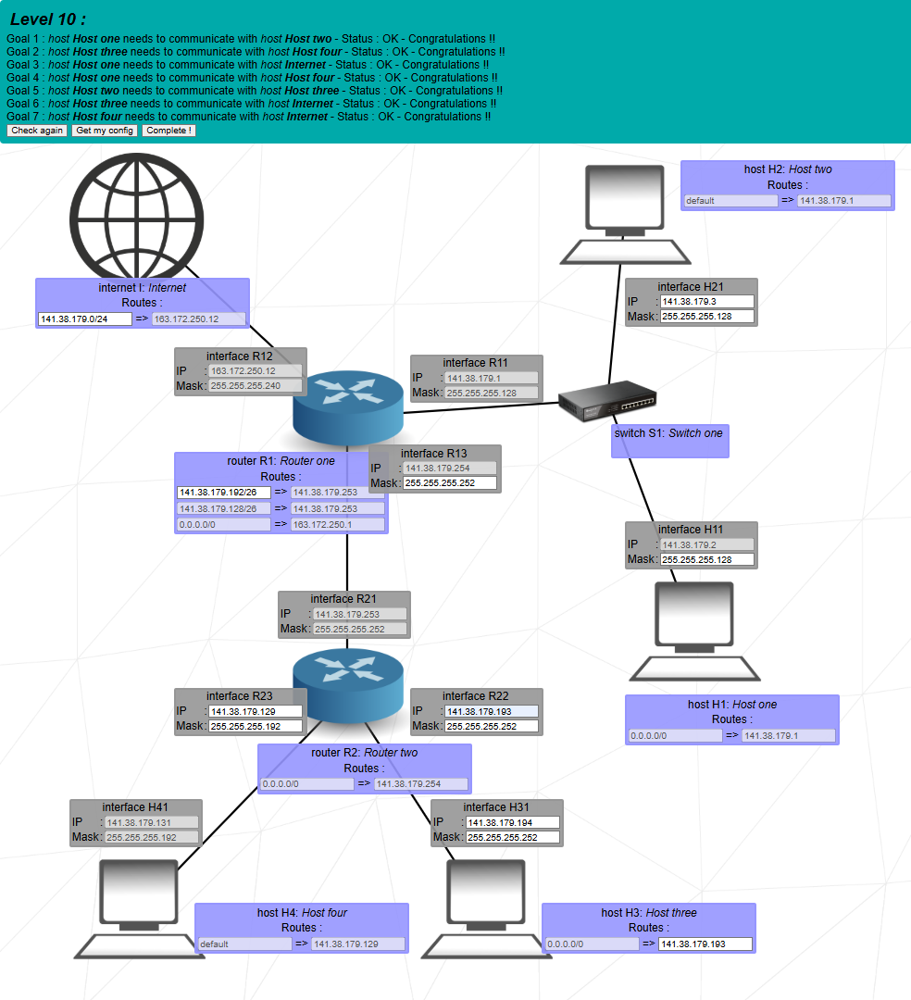
   

 

---

## Author

| **Name**               | **GitHub Profile**                            | **42 Login** |
| ---------------------- | --------------------------------------------- | ------------ |
| **Oliver King Zamora** | [OliverKingz](https://github.com/OliverKingz) | **ozamora-** |

---

## Acknowledgments

- **42 Network**: For the simulated training environment.
- **Peers**: Collaborative debugging and subnetting tips.

---
